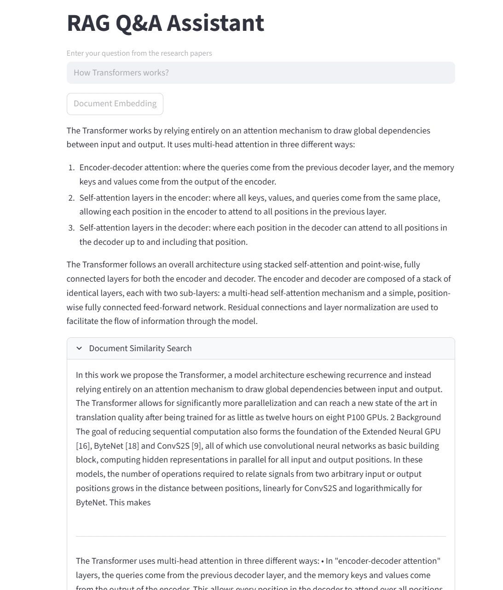

# RAG Q&A Assistant

A simple Streamlit app for asking questions about research papers using Retrieval-Augmented Generation (RAG). It loads PDFs, creates embeddings, and answers based on document content.

## Requirements
- Python 3.8+
- API keys for OpenAI and Groq (in .env file)

## Installation
1. Install dependencies: `pip install -r requirements.txt`
2. Add your API keys to a .env file:
   ```
   OPENAI_API_KEY=your_key
   GROQ_API_KEY=your_key
   ```

## Usage
1. Put PDFs in research_papers folder.
2. Run: `streamlit run app.py`
3. Click "Document Embedding" to process docs.
4. Ask questions and get answers!

Note: Processes first 50 docs by default. Adjust in code if needed.

## Example:
